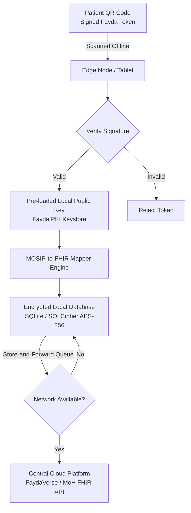

# MOSIP-to-FHIR Offline Verification Bridge 🏥⚡

> **An Open-Source Architectural Specification and Technical Blueprint for Last-Mile Digital Health Interoperability in Low-Connectivity Environments.**

[](LICENSE)
[]()
[]()
[]()

---

## 1. Executive Summary & The Last-Mile Problem

Digital Public Infrastructure (DPI) initiatives across East Africa—such as Ethiopia's **Fayda National ID** platform (built on MOSIP standards)—are establishing foundational layers for digital governance and public service delivery. Concurrently, national health ministries are accelerating electronic health record (EHR) deployments.

However, a critical architectural disconnect exists at the last mile: **Centralized, cloud-only verification models fail catastrophically in rural and peripheral healthcare settings.**

In rural clinics, health posts, and mobile health units operating under chronic power grid instability and zero internet connectivity, centralized verification APIs break down. Clinicians are forced to choose between halting care or operating completely blind.

**The MOSIP-to-FHIR Offline Verification Bridge** provides an open-source architectural specification that decouples trust from cloud connectivity—enabling offline cryptographic identity verification, automatic translation into international **HL7 FHIR health records**, and secure **Store-and-Forward synchronization** when network paths reopen.

---

## 2. High-Level System Architecture



## 3. Core Technical Pillars

The specification is broken down into four foundational pillars detailed inside the `docs/` directory:

- **Zero-Data Cryptographic e-KYC** (`docs/02-offline-auth-spec.md`)
  - Utilizes asymmetric cryptography (ECDSA/RSA) and pre-loaded public key bundles to cryptographically verify time-signed national ID QR codes with 0 bytes of internet data.

- **Identity-to-Health Interoperability** (`docs/03-fhir-mapping.md`)
  - Provides a strict semantic translation dictionary mapping national ID claims (UIN, demographic attributes) directly into standardized HL7 FHIR Release 4 (Patient) JSON resources.

- **Store-and-Forward Edge Synchronization** (`docs/04-edge-sync-protocol.md`)
  - Implements AES-256 encrypted local SQLite/Realm storage with transactional outbound queues, background network monitors, and optimistic locking for conflict-free cloud synchronization.

- **Security & Compliance Framework**
  - Enforces data minimization, zero-biometric retention on edge nodes, local role-based access control (RBAC), and append-only audit logs.

## 4. Repository Structure

```text
mosip-fhir-offline-bridge/
├── README.md                      # Master Technical Whitepaper (You are here)
├── LICENSE                        # Open Source MIT License
├── docs/                          # Detailed Technical Specifications
│   ├── 01-problem-statement.md    # Rural infrastructure constraints & clinical impact
│   ├── 02-offline-auth-spec.md    # Cryptographic trust model & public key caching
│   ├── 03-fhir-mapping.md         # Semantic mapping dictionary (MOSIP to HL7 FHIR)
│   └── 04-edge-sync-protocol.md   # Store-and-forward queueing & conflict resolution
├── schemas/                       # Reference Data Models & JSON Payloads
│   ├── fayda-qr-payload.json      # Mock decrypted Fayda ID QR token structure
│   └── fhir-patient.json          # Valid HL7 FHIR Patient resource representation
├── diagrams/                      # System Visualizations & Sequence Workflows
│   └── offline-auth-sequence.mmd  # Mermaid sequence diagram for offline auth
└── proof-of-concept/              # Conceptual Code Snippets
    ├── verify_qr_signature.py     # Python script for offline public key verification
    └── mock_sync_worker.js        # JavaScript background worker for sync queueing
```

## 5. Quick Inspection: Data Schemas & PoC

- **Examine Data Mappings:** Review `schemas/fayda-qr-payload.json` to see a sample decrypted ID token, and `schemas/fhir-patient.json` to see its translated FHIR equivalent.
- **Review Verification Logic:** Check `proof-of-concept/verify_qr_signature.py` for a lightweight Python implementation of offline public key signature validation.
- **Review Sync Queueing:** Check `proof-of-concept/mock_sync_worker.js` for edge queue management and online connectivity listeners.

## 6. Contributing & Community Feedback

This repository is maintained as an open architectural specification. We welcome peer reviews, architectural critiques, and contributions from digital public infrastructure (DPI) specialists, health informatics engineers, and public health practitioners.

1. Fork the repository.
2. Create your feature branch (`git checkout -b feature/architectural-improvement`).
3. Commit your changes (`git commit -m 'Add review notes on edge sync conflict handling'`).
4. Push to the branch (`git push origin feature/architectural-improvement`).
5. Open a Pull Request.

## 7. License

Distributed under the MIT License. See [LICENSE](LICENSE) for more information.

---
